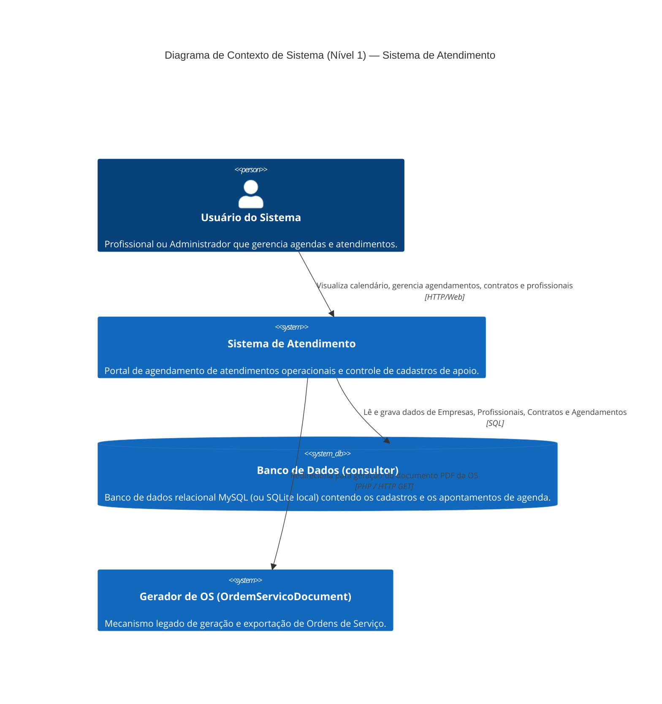
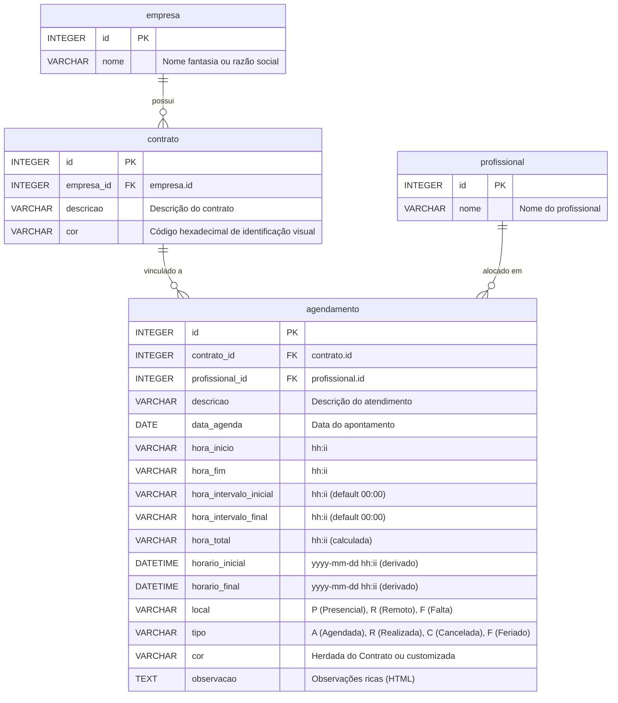

# Arquitetura Geral do Sistema Legado — atendimento

Este documento apresenta a arquitetura do sistema legado baseada nas rotinas essenciais selecionadas para migração: **AgendamentoList, AgendamentoCalendarioForm, Contrato, Profissional e Empresa**.

---

## 🏗️ Visão Geral da Arquitetura

O sistema atual foi desenvolvido utilizando a linguagem **PHP 7.4+** sob o **Adianti Framework**. Ele segue uma arquitetura monolítica clássica baseada em componentes visuais e controle orientados a eventos, onde a lógica de visualização (HTML/JS/CSS) e a lógica de negócios (validações, regras operacionais e consultas SQL) residem fortemente acopladas nas classes de formulário e listagem (camada Control/View).

A persistência de dados utiliza o padrão **Active Record** (através da classe `TRecord` do Adianti), conectando-se diretamente a uma base de dados relacional (banco de dados `consultor`, tipicamente hospedado em MySQL/MariaDB).

---

## 🗺️ Diagrama de Contexto de Sistema (Nível 1)

---

## 🗄️ Modelo Entidade-Relacionamento Resumido (ERD)

Abaixo está o modelo de banco de dados mapeado apenas para as entidades incluídas no escopo:

### 🟢 Escala de Confiança do Relacionamento de Entidades
*   **Mapeamento de Tabelas e Chaves:** 🟢 **CONFIRMADO** — Extraído diretamente das classes de modelo ActiveRecord em `app/model/`.

---

## 🔌 Integrações Externas e Internas

1.  **Geração e Impressão de OS (`OrdemServicoDocument`)**:
    *   Ocorre a partir da linha da listagem (`AgendamentoList`) ou do botão `OS` no formulário lateral (`AgendamentoCalendarioForm`).
    *   Trata-se de um redirecionamento de tela (`TApplication::loadPage('OrdemServicoDocument', 'onGenerate', ['key' => $id])`) que renderiza o arquivo de OS em formato PDF/HTML.
2.  **Exportação de Dados (`AgendamentoList`)**:
    *   Rotinas embutidas no framework Adianti para conversão e download de dados da grade em formatos **CSV, XLS, PDF e XML**.

---

## ⚠️ Dívidas Técnicas Críticas Observadas

1.  **Lógica de Negócios Acoplada na View/Control**:
    *   Validações importantes (como "só permitir confirmar se status original for Agendado" e "cálculo matemático de horas líquidas de almoço") estão codificadas diretamente nas ações de UI (`onSave` e `onConfirmar` no controlador da tela), o que dificulta testes unitários e expõe o sistema a falhas se os mesmos dados forem alterados via API ou em lote.
2.  **Duplicidade de Campos de Data e Hora**:
    *   A tabela `agendamento` armazena campos duplicados como `data_agenda`, `hora_inicio`, `hora_fim` juntamente com `horario_inicial` e `horario_final` (datetimes inteiros). Isso exige scripts complexos de sincronização de datas e horas a cada atualização de registro.
3.  **Lógica Científica em Formato de String**:
    *   O tempo trabalhado (`hora_total`) é armazenado como string (`VARCHAR`) no banco e manipulado via string no PHP. Em uma migração moderna, isso deve ser tratado usando tipos apropriados de intervalo de tempo (ou cálculo computado sob timestamps no backend).
