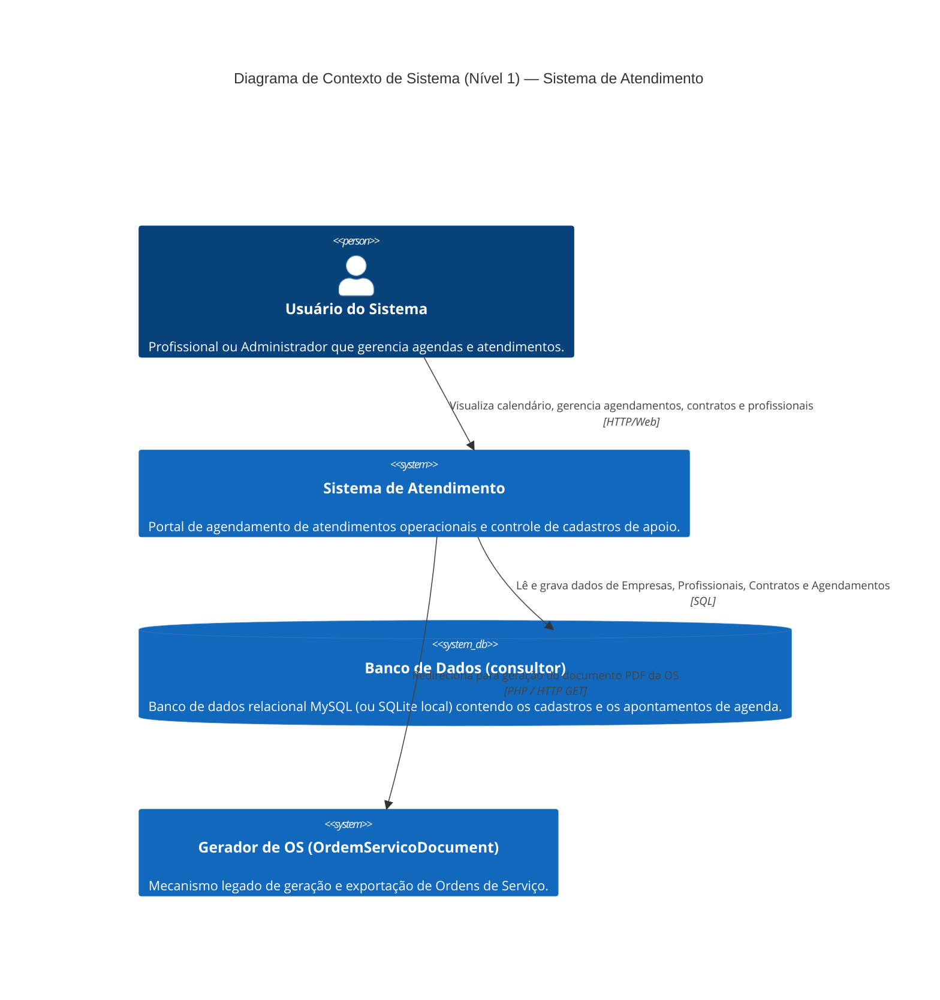

# C4 Context Diagram — atendimento

Este documento apresenta o diagrama C4 de Contexto (Nível 1) para o sistema de atendimento, representando os usuários, limites do sistema e suas dependências externas sob o escopo das rotinas selecionadas.

---

## 🟢 Escala de Confiança do Contexto Mapeado
*   **Atores e Papéis:** 🟢 **CONFIRMADO** — Extraído dos arquivos de visualização e controle da agenda.
*   **Integração com Banco de Dados:** 🟢 **CONFIRMADO** — Conexões explícitas com o banco `consultor` usando as ActiveRecords `Agendamento`, `Contrato`, `Profissional` e `Empresa`.
*   **Integração com Emissor de OS:** 🟢 **CONFIRMADO** — Chamadas para a classe `OrdemServicoDocument` passando o ID do agendamento sob o parâmetro `key`.
