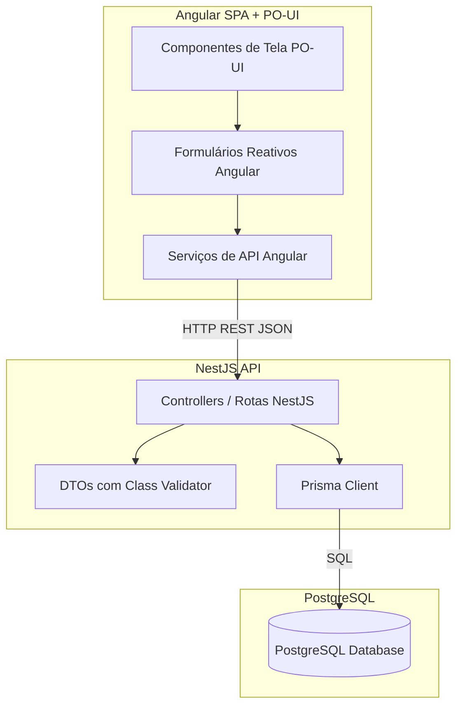

# Target Architecture — atendimento

> Arquitetura alvo do sistema novo, respeitando o paradigma escolhido Híbrido (Equilibrado) e a topologia moderna de Bounded Contexts.

## Visão geral
O novo sistema de atendimento é composto por um frontend SPA desenvolvido em **Angular + PO-UI** e um backend API REST desenvolvido em **NestJS** com **TypeScript** e **Prisma ORM**, persistindo dados em um banco de dados **PostgreSQL**. A arquitetura segue o paradigma Híbrido (Equilibrado), centralizando regras de negócio e validações nos controllers/módulos do NestJS para manter a simplicidade técnica, e organiza a base de código física de forma limpa seguindo os domínios mapeados para o MVP, desvinculando-se do monolito acoplado PHP/Adianti.

## Diagrama (Mermaid)

## Componentes

| Componente | Tipo | Responsabilidade | Origem (legado / novo / fundido) |
|---|---|---|---|
| `Angular SPA` | Frontend App (UI) | Interface de usuário moderna contendo o calendário, listagens e formulários reativos usando PO-UI. | Legado (TFullCalendar/TForm) - redesenhado do zero |
| `NestJS API` | API Service (Backend) | API REST contendo controllers estruturados para validações, cálculos de duração e manipulação de status. | Legado (Adianti Controllers/ActiveRecord) - reescrito e fundido |
| `Prisma ORM` | Data Access | Camada de persistência desacoplada da lógica de negócios, mapeando tabelas de PostgreSQL. | Legado (ActiveRecord TRecord) - substituído |
| `PostgreSQL` | Banco de Dados | Banco relacional independente contendo as tabelas do MVP higienizadas na migração. | Legado (MySQL/SQLite consultor) - migrado |

## Bounded contexts

### BC-01: Cadastros de Apoio (`cadastros-apoio`)
- **Responsabilidade**: Gestão das entidades de base que servem de suporte obrigatório para os agendamentos (Empresas, Profissionais e Contratos comerciais).
- **Justificativa do agrupamento / separação**: O legado separava as classes de formulário em `cadastros_basicos` e `servicos/ContratoForm.php`. Fundimos esses cadastros em um único contexto coeso de Apoio porque eles possuem ciclo de vida simples de CRUD e servem ao mesmo propósito de infraestrutura operacional da agenda.
- **Componentes internos**:
  - `EmpresaController` (Gerenciamento de clientes)
  - `ProfissionalController` (Gerenciamento de executores)
  - `ContratoController` (Controle comercial de contratos com escalas de trabalho semanais)

### BC-02: Agendamentos e Relatórios (`agendamentos`)
- **Responsabilidade**: Controle da grade de agendamentos operacionais (calendário interativo), cálculo de tempo de trabalho líquido e fechamento em lote de apontamentos com geração de relatórios analíticos de atividades realizadas (`Realizado`).
- **Justificativa do agrupamento / separação**: Agrupa toda a lógica do ciclo de vida do agendamento (inclusão, alteração de status e faturamento/fechamento em lote) em um bounded context único, garantindo integridade e facilidade de manutenção para a regra financeira central do MVP.
- **Componentes internos**:
  - `AgendamentoController` (CRUD de agenda, validação de imutabilidade e cálculo de tempo)
  - `RelatorioController` (Visualização e exportação de atividades finalizadas na tabela `Realizado`)

---

## Decisões arquiteturais (ADR-style resumido)

### AD-01: Centralização de Regras nos Controllers (Paradigma Híbrido)
- **Decisão**: Toda a lógica de validação de imutabilidade de status (tipo) e cálculo de duração líquida descontando intervalo é implementada de forma simplificada diretamente dentro dos controllers/módulos NestJS (usando DTOs com `class-validator` e utilitários dedicados), sem criar camadas extras redundantes de Services ou Repositories.
- **Alternativas descartadas**: Padrão de arquitetura em 3 camadas clássico (Controllers -> Services -> Repositories).
- **Justificativa**: Conforme decidido pelo PO (Opção 3 do Advisor), o tamanho enxuto do MVP não justifica inflar o código com excesso de abstrações e injeções desnecessárias, mantendo o backend simples de ler e de manter.
- **Rastreabilidade**: `paradigm_decision.md` § Escolha 3.

### AD-02: Armazenamento de Duração em Minutos Inteiros
- **Decisão**: Substituir o campo de persistência string `hora_total` (hh:ii) por um inteiro `duracao_minutos` no PostgreSQL.
- **Alternativas descartadas**: Manter o campo `hora_total` como string textual ou usar tipos de intervalo do Postgres (`INTERVAL`).
- **Justificativa**: Facilita a agregação de horas (somas e médias) para os relatórios do faturamento no banco sem a necessidade de conversões em query SQL. O frontend e as classes utilitárias tratam de formatar a exibição para `hh:ii` na UI.
- **Rastreabilidade**: `discard_log.md` § BR-DESCARTAR-002.

---

## Honra ao paradigma escolhido
- **Paradigma alvo**: OO com Injeção de Dependências (DI) e Data Mapper (Híbrido/Equilibrado).
- **Como a arquitetura honra esse paradigma**:
  - **Divisão API / SPA clara**: O frontend Angular não acessa ou executa queries de banco direta, apenas consome a API REST estruturada.
  - **Injeção de Dependências**: O `PrismaService` é registrado globalmente e injetado nos módulos NestJS para persistência limpa, aplicando o padrão Data Mapper.
  - **Controle centralizado no Controller**: As validações do `class-validator` nos DTOs de entrada rejeitam requisições corrompidas na borda da API. A lógica de imutabilidade e cálculos é validada e executada antes da gravação no banco, de forma direta no controller.

---

## Honra à topologia escolhida
- **Topologia confirmada**: Adotar Topologia Moderna (Opção 2) no frontend e backend.
- **Como se materializa**: A estrutura de pastas reflete estritamente os dois bounded contexts (`cadastros-apoio` e `agendamentos`). Não existem pastas gerais de repositórios ou formulários técnicos soltos; todos os arquivos de um domínio vivem sob a mesma subpasta, tanto no backend quanto no frontend.
