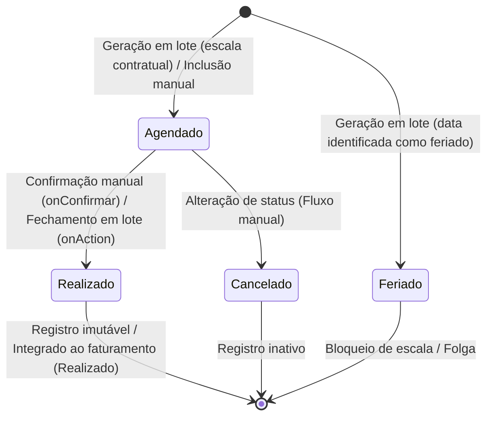

# Máquinas de Estado — atendimento

Este documento descreve as máquinas de estado identificadas no sistema legado, com foco principal no ciclo de vida dos agendamentos, detalhando transições, gatilhos e restrições.

---

## 📅 Ciclo de Vida do Agendamento (`Agendamento->tipo`)

O `Agendamento` é a entidade central do sistema e possui um campo de status (`tipo`) que controla o fluxo do processo operacional de atendimento.

### 📊 Diagrama de Transição de Estados (Mermaid)

---

## 🛠️ Detalhamento das Transições e Gatilhos

### 1. Inicialização

#### Transição: `[*] ➔ Agendado (A)`
*   **Gatilho:**
    *   **Automático:** Execução da rotina de geração em lote baseada em calendário de contratos ativos ([GerarApontamento.php](file:///C:/Patay/Ricardo/VPS/atendimento/antigo/app/control/servicos/GerarApontamento.php)), que analisa a escala semanal dos profissionais no período e cria registros pendentes.
    *   **Manual:** Usuário cria um novo registro diretamente através da interface de calendário ([AgendamentoCalendarioForm.php](file:///C:/Patay/Ricardo/VPS/atendimento/antigo/app/control/servicos/AgendamentoCalendarioForm.php)). Se nenhum status for enviado no formulário, o valor padrão `'A'` é atribuído.
*   **Validações:** Descrição, horário inicial e horário final são campos obrigatórios.
*   **Confiança:** 🟢 **CONFIRMADO**

#### Transição: `[*] ➔ Feriado (F)`
*   **Gatilho:** Execução da rotina de geração em lote. Se a data de processamento coincidir com uma data cadastrada no repositório de Feriados, a escala contratual normal daquele dia é ignorada para o profissional e um registro do tipo `'F'` é gerado.
*   **Validações:** Associado ao contrato padrão do sistema (`contrato_id = 4`) e pintado com a cor hexadecimal vermelha (`#f42b06`).
*   **Confiança:** 🟢 **CONFIRMADO**

---

### 2. Execução e Fechamento

#### Transição: `Agendado (A) ➔ Realizado (R)`
*   **Gatilho:**
    *   **Manual (Individual):** Usuário clica no botão "Confirmar" da tela de calendário ([AgendamentoCalendarioForm::onConfirmar](file:///C:/Patay/Ricardo/VPS/atendimento/antigo/app/control/servicos/AgendamentoCalendarioForm.php#L370-L444)).
    *   **Automático (Lote):** Usuário executa a rotina de fechamento de apontamentos da janela modal ([ConfirmarApontamento::onAction](file:///C:/Patay/Ricardo/VPS/atendimento/antigo/app/control/servicos/ConfirmarApontamento.php#L69-L173)), que atualiza o status de todos os registros `'A'` e insere dados analíticos de cobrança correspondentes na tabela de `Realizado`.
*   **Restrições e Validações:**
    *   A alteração só é permitida se o status anterior do agendamento for estritamente igual a `'A'`. Caso contrário, a alteração é abortada com erro ("Registro não pode ser alterado").
*   **Confiança:** 🟢 **CONFIRMADO**

#### Transição: `Agendado (A) ➔ Cancelado (C)`
*   **Gatilho:** Atualização manual de status de agendamento na interface de agenda.
*   **Confiança:** 🟢 **CONFIRMADO**

---

### 3. Estados Terminais e Restrições de Mutabilidade

#### Estados: `Realizado (R)`, `Cancelado (C)` e `Feriado (F)`
*   **Regra de Imutabilidade:** Uma vez que um agendamento transita para um destes estados, ele se torna logicamente imutável para novos salvamentos manuais ou confirmações. Qualquer tentativa de alteração disparada pelo formulário é bloqueada se o status em banco for diferente de `'A'`.
*   **Confiança:** 🟢 **CONFIRMADO** — Implementado na verificação condicional `$object->tipo <> 'A'` que invoca `TTransaction::rollback()`.
