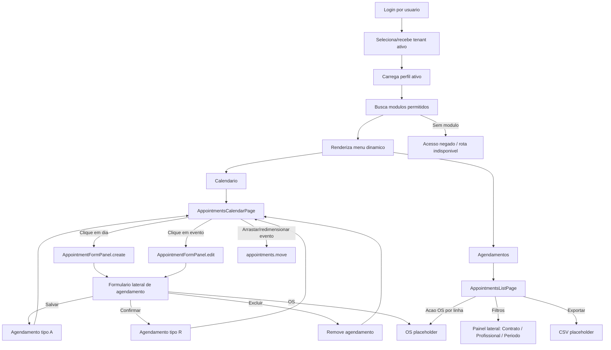

# Fluxo de Navegacao - Agendamento

## Pontos de entrada

- Login por usuario autenticado.
- Tenant ativo definido no login ou no contexto inicial do usuario.
- Perfil ativo carregado para o usuario dentro do tenant.
- Menu dinamico renderizado a partir dos modulos liberados para o perfil ativo.
- `Calendario`, quando o perfil possui modulo `appointments-calendar`.
- `Agendamentos`, quando o perfil possui modulo `appointments-list`.

## Pontos de saida

- Exportacao da listagem.
- Geracao de Ordem de Servico.
- Fechamento do painel lateral apos salvar.
